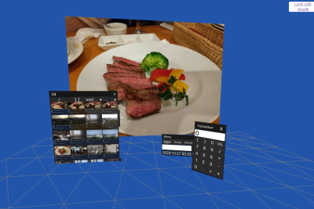

# VR Workspace

WebVR/WebXR Workspace using AFrame
This is a fork project from https://github.com/binzume for personal use

## Demo

https://tihung99123.github.io/web-vr-workspace/

Please access the above URL using OculusQuest etc. Then click the "VR" or "AR" button.
If are you using Android Phone you can click the the "VR" or "AR" button but not using tracking for the window in workspace.

- Press the trigger button on your controller and use the grip button to bring up the menu and enter gestures.
- Drag the window etc. while holding down the grip button. Control distance to objects
- If you want to use files on Google Drive, first allow access in "Storage Settings".

Although a server is not required, the WebXR Device API requires access via https:// using a suitable HTTP server.
Also, if you want to upload and use it in a different environment, please change the Google API clientId etc.

## Features

- Physics
- Hand tracking
- VR app dynamic loading 
- Cursor tracking (testing)

## Available apps

Please refer to [docs/application.md](docs/application.md) for how to implement the application.

- Calculator (testing)
- Notepad (testing)
- Paint3D (testing)
- Console (testing)
- Task Manager(testing)
- Media Player (testing)
- Storage (disable)
  - Google Drive client (disable)
  - WebkitFileSystem (disable)
  - Demo storage (Read Only) (disable)
- WebRTC Remote Desktop ( https://github.com/binzume/webrtc-rdp ) (testing)
- VNC Client (needs websockify) (disable)
- VRM model viewer (testing)
- Youtube (testing)
- Chrome VR (Testing)

## License

MIT License
